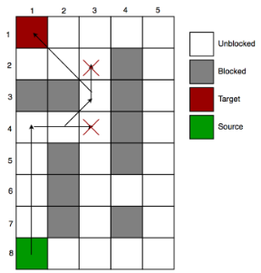
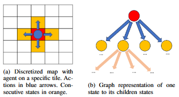
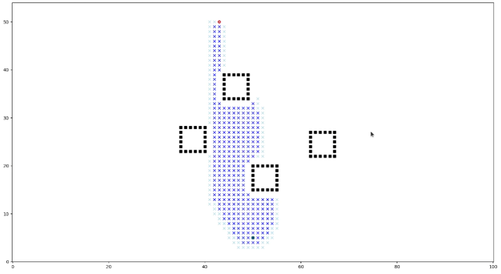
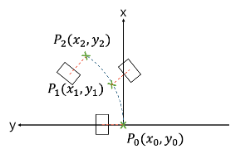
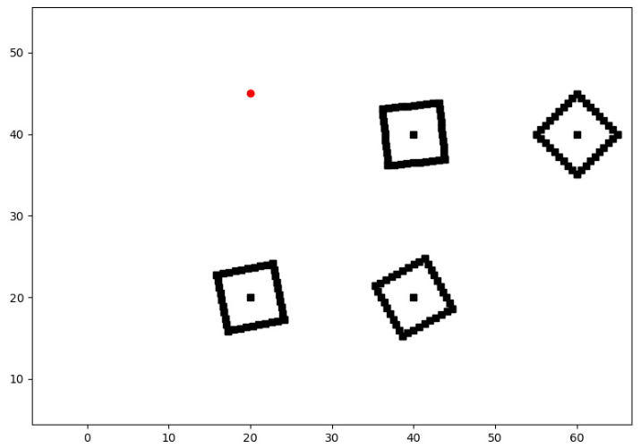
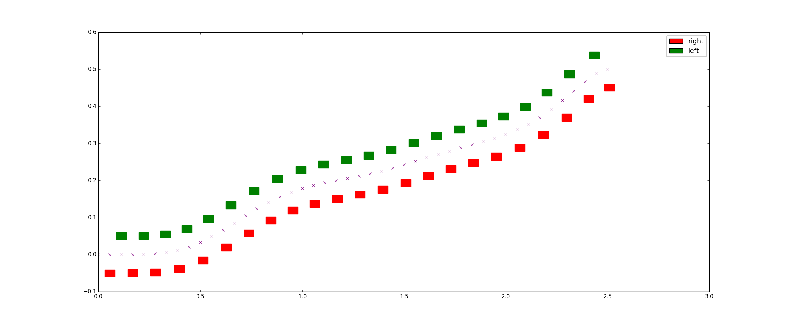

# Navigation & Walking Control of a NAO humanoid robot

This branch hosts the final submission of group 2 for HRS WS 2024.

For further documentation, read through the document at [overleaf](https://www.overleaf.com/project/6792c1ea38611760eb39f9cc).

Videos of the tests can be found [here](https://onedrive.live.com/?id=2CE7773A91366522%21s1c92c9a9eeac4d8a9dbd7306f89d7723&resid=2CE7773A91366522%21s1c92c9a9eeac4d8a9dbd7306f89d7723&cid=2ce7773a91366522&ithint=folder&redeem=aHR0cHM6Ly8xZHJ2Lm1zL2YvYy8yY2U3NzczYTkxMzY2NTIyL0VxbkpraHlzN29wTm5iMXpCdmlkZHlNQlFMVVJLQ3hyVTdHRmsyZHFJWUpyT2c&migratedtospo=true&v=validatepermission).

Group members: Rohan Singh, Richard Willke, Yueyang Zhang


## Problem Formulation

Navigation problems are classified into three main types: 
- Fully known environments without uncertainties 
- Partially known environments with uncertainties uncovered through exploration
- Unknown environments that can change post exploration and are updated upon re-detection

The problem of this project is of type 2. Here, the robot is set to navigate to a known goal position from its start position while avioding obstacles. 
During navigation, the robot has to continuously update its map upon finding discrepancies with its internal model of the map. 



## Solution Aproach 

1. Path finding with A* 

The robot uses a discrete checkerboard grid structure for the A* Path-Finding algorithm. The A* algorithm uses the grid to find the shortest path to the goal via graph search. 


Simulation results with obstacles (black) are demonstrated here: 


2. Footstep Planning & Gait control 

The trajectory generated by the A* algorithm returns discrete linear segments. Before execution, the trajectory is smoothened by using splines. Around this trajectory, the footsteps of the robot are planned for later execution.


3. Obstacle Detection & Map Model

The obstacles used are small wooden cubes equipped with visual identifiers. Upon discovery of one of a previously unknown obstacle, is position and orientation gets added to the map. A voxelization then approximates the obstacle on the 2D grid map. 



For more detailled informations, refer to the documentation folder. 

## Results 



<video controls src="final_vid.mp4" title="Title"></video>


# Code Implementation

## Building

After the devcontainer is built, make sure the scripts are executable:

```bash
chmod +x hrs_ws/src/main/scripts/main_execute_tactile.py
```

then, in the `hrs_ws/`, build the workspace:

```bash
catkin build
```

NOTE: execute every command from within the workspace `hrs_ws/`.

## Running

For this project, you need at least 5 terminals.

### Bringup

Before running the code, bringup the robot in the first terminal,

```bash
roslaunch nao_bringup nao_full_py.launch
```

This will connect the computer to the robot and enables the exacution of nodes that require the robot interface. 

Secondly, to enable tactile interface,start the tactile node in the 2nd terminal:

```bash
roslaunch nao_apps tactile.launch
```

You can now try to press the buttons on the robot. The top buttons are used in this project. The front button is used to start the initialization of the routine via the speech interface. The middle button is used in case the robot falls over. Upon pressing it, the robot stands up again.


### Part 1: Visualization in RVIZ

RVIZ is used to visualize the entire data about the map. It visualizes the poses of all previously discovered  obstacles / the goal, the robot pose as well as the planned path towards the goal.

For this part, start rviz in the 3rd terminal:

```bash
rviz
```

To visualize all the necessary data, add the following message structures to the rviz window: 
two markers, one marker array, one path, one tf tree. 

First, change the reference frame on rviz from "map" to "odom". 

Then add one marker for the KF filter under the publishing name "/pred_position". 

The second marker message represents the goal position. It is published under "/goal_position". 

For the marker array, subscribe to the publishing message "/obstacles_positions". The marker array represents the obstacles in the map. 

The path that the robot takes is published under "/nao_path_walker". 

Last but not least, select from the tf tree the frames "odom", "torso" and "camera_top".

### Part 2: Launching the main node

The main node holds the central functionalities of the code. Upon launching it, the robot is being initialized with all of its properties except the camera node. The camera node is being initalized in a separate terminal.

For this part, start the main node in the 4th terminal:

```bash
rosrun main main_execute_tactile.py
```

### Part 3: Launching the camera node

The main node holds the central functionalities of the code. Upon launching it, the robot is being initialized with all of its properties except the camera node. The camera node is being initalized in a separate terminal.

For this part, start the main node in the 5th terminal:

```bash
rosrun sensor_libs camera.py
```

### Part 4: Running the code 

To run the program, tap the front button on the head of the robot. The robot will wait for you to address him. Say "hello" or "hi" so that he recognizes you. Once he recognized you, say "go".

The robot will then be ready to go to the desired goal. For the goal, use an aruco marker with ID 2. An aruco generator can be used [here](https://chev.me/arucogen/). Select "Original ArUco" as an option with size 60. Do the same for all the obstacles. The valid IDs for obstacles are 12, 16 and 24.

Once the goal is detected in the top camera, the robot will start walking towards it. You can influence the robot's trajectory by placing any of the obstacles infront of him.

Note that the aruco marker on the obstacles must be placed in a way that the robot is still able to detect the aruco position and orientation with respect to the optical frame of the bottom camera.

Once the robot reaches the goal, it will stop walking. Alternatively, if the robot falls at any given moment, press the middle button on the top of the NAO's head. The robot will stand up on its own and resume wlaking to the goal.