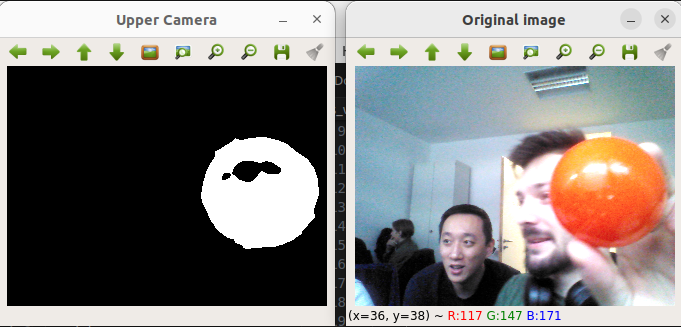
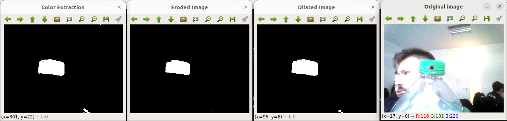
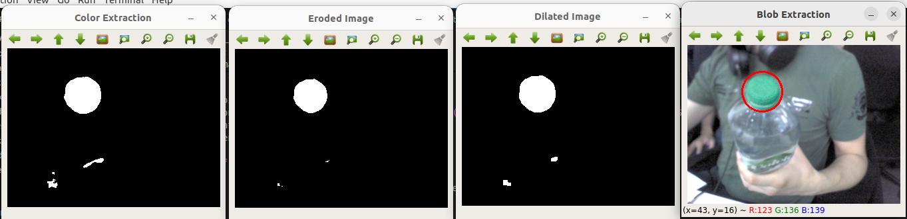
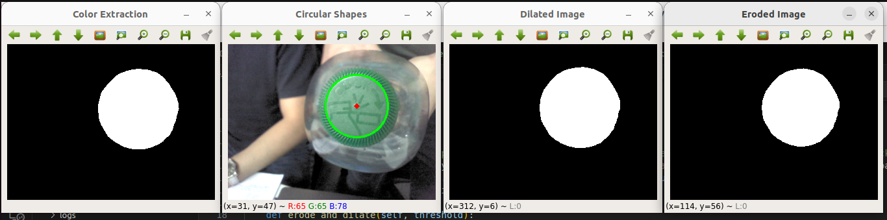

# HRS Tutorial 3

This branch hosts the codebase of tutorial 3 of lecture "Humanoid Robot Systems".

## Build and Run

After building the devcontainer, **navigate to `hrs_ws` directory**, build and source the workspace as follows:

```bash
catkin build -DCMAKE_BUILD_TYPE=Release
source devel/setup.bash
```

and then, make the python script executable:

```bash
chmod +x src/tutorial_3/scripts/tutorial_3.py
```

run the script with:

```bash
rosrun tutorial_3 tutorial_3.py
```

## Deliverables

Here are required screenshots.

### Task 2

Color extraction: red



### Task 5

Blob extraction, eroded and dilated

CoM:



Circled:



### Task 7

Circular shape detection

