# HRS Tutorial 4

This branch hosts tutorial 4 for lecture Humanoid Robotic Systems.

Same README as pdf file is available in the root foler, which is easier to read.

## Building & Running

After the devcontainer is built, make sure the script is executable:

```bash
chmod +x hrs_ws/src/tutorial_4/scripts/tutorial_4.py
```

then, in the `hrs_ws` build the workspace:

```bash
catkin build
```

To run the code, firstly bringup the robot, then run:

```bash
rosrun tutorial_4 tutorial_4.py
```

With the script running, press <kbd>a</kbd> to select ROI, with <kbd>enter</kbd> to confirm your selection

## Deliverables

The required screenshots are documented here.

### Image Conversion and ROI selection

Figure 1 shows the original image, the corresponding HSV image and the selected ROI

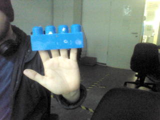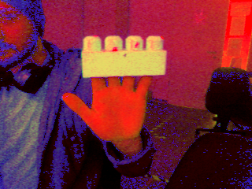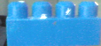

**Figure 1:** from left to right you see original image, HSV image and selected ROI.

### Tracking with MeanShift

The following images (figure 2-4) show the tracking result with mean shift method, the size of bounding box remains unchanged.

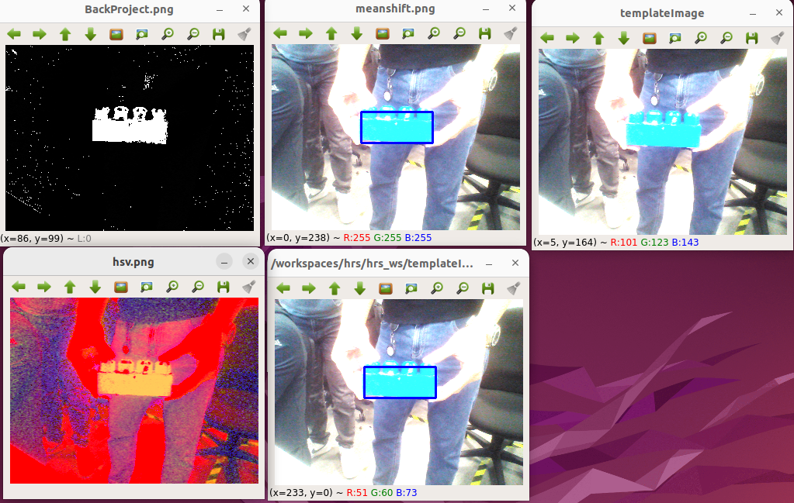

**Figure 2:** mean shift with object in the center of image.

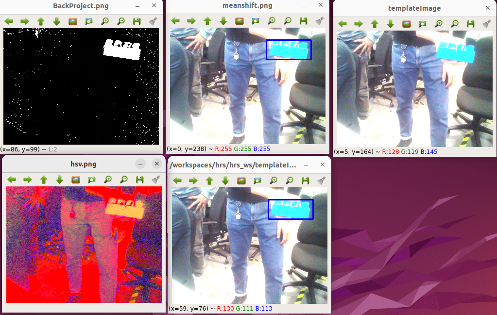

**Figure 3:** mean shift with object on the upper-right of image.

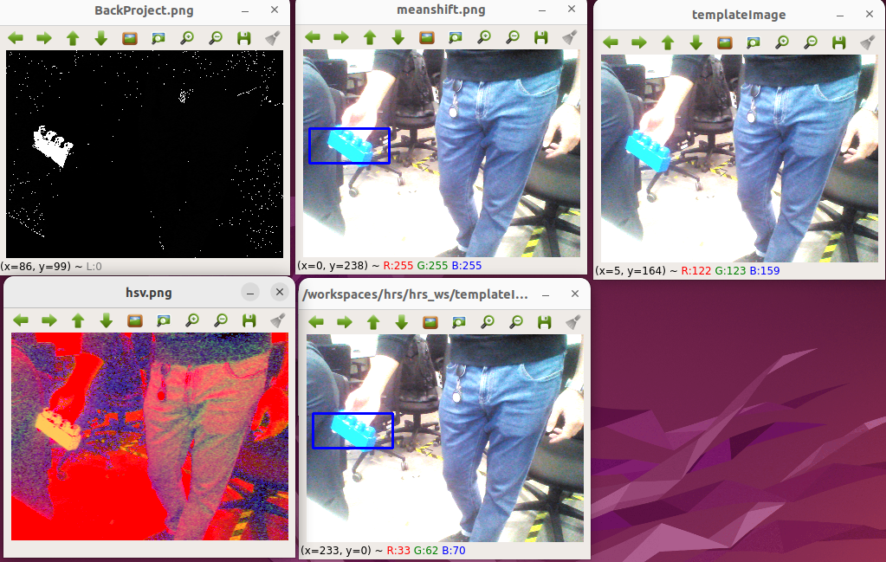

**Figure 4:** mean shift with object on the left of image.

### Tracking with CAMShift

The following images (figure 5-7) show the tracking result with CAM shift method, the size of bounding box changes according to the target to-be-tracked, the orientation can also adjust to the target.

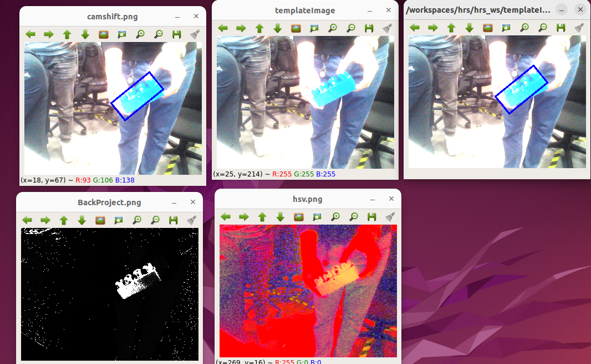

**Figure 5:** CAM shift with object in the center of image

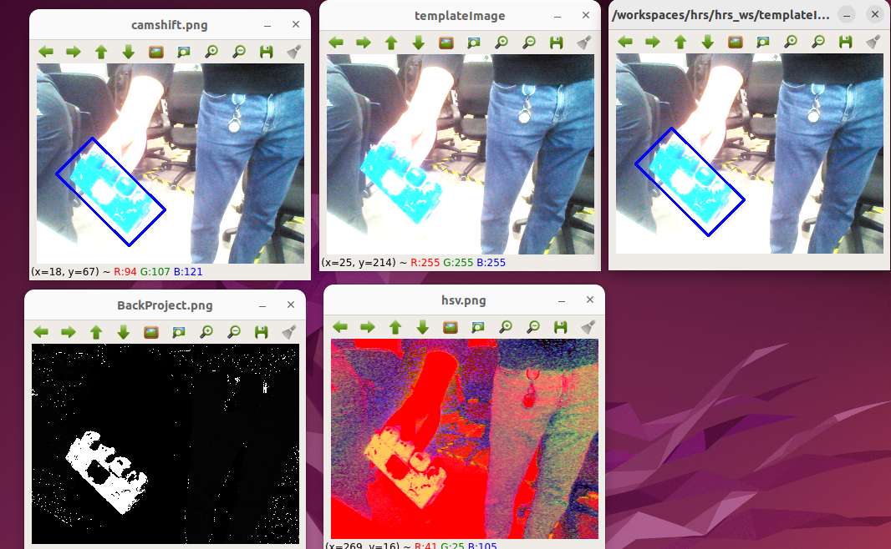

**Figure 6:** CAM shift with object on the lower-left of image

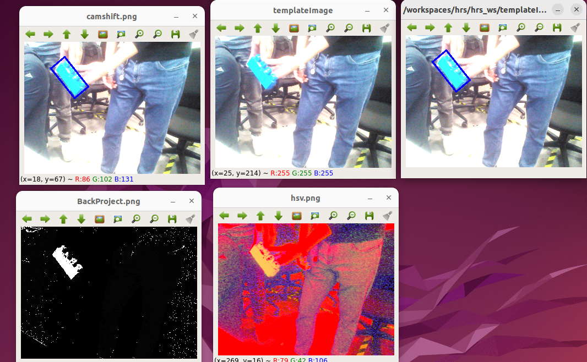

**Figure 7:** CAM shift with object on the upper-left corner of image

### Difference between CAM shift and mean shift

**Mean Shift:**

1. Non-parametric feature-space analysis technique;
2. Used to find the mode (the highest density) in a given probability distribution;
3. Helps track objects by iteratively shifting a window to the peak of the density of pixels in the RoI;
4. *Algorithm*: Initial Position -> Histogram Backprojection -> Mean Shift Calculation -> Repeat until convergence.

**CAM Shift:**

1. Extension of MeanShift;
2. Adapts the size of the tracking window based on the tracked object’s size and orientation, making it more suitable for tracking objects that change in size and shape;
3. *Algorithm*: Initial Position and Size -> Mean Shift -> Adjust window size and orientation -> Repeat as object moves.

**Answer:**

1. Mean Shift: The window size remains constant throughout the tracking process. -> Suitable for tracking objects with a fixed size and shape;
2. CAM Shift: The window size and orientation are continuously adapted to fit the object better. -> Better for tracking objects that can change in size and orientation;
3. CAM shift is basically continuously adaptive mean shift.

### Optical Flow

The image below shows the optical flow with green lines.

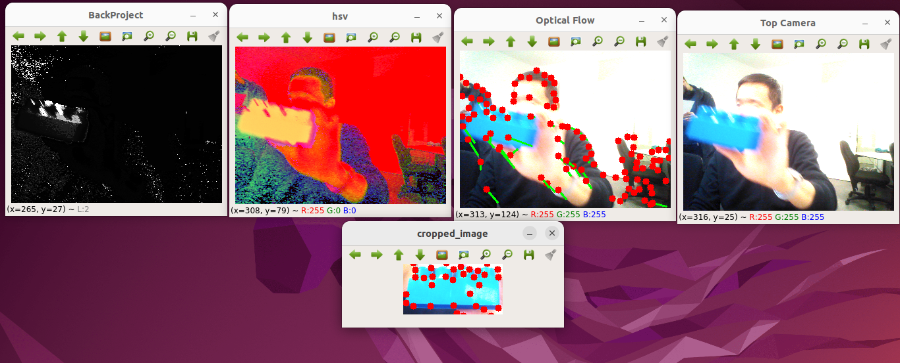

### ARUCO Marker Detection

The following images (figure 8-10) show the tracking result of an ARUCO marker, with 3D pose shown on the image, the concrete pose is also printed in the terminal.

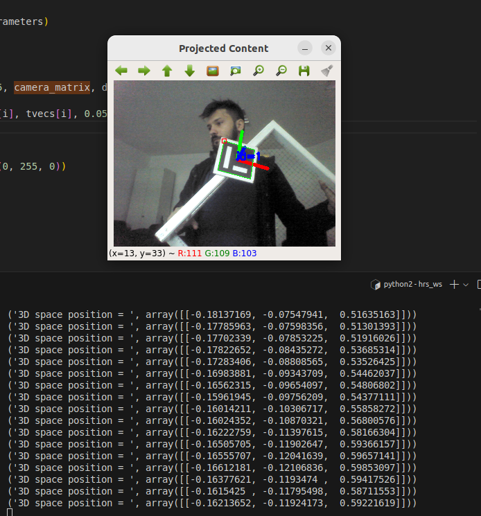

**Figure 8:** Tracking a marker with 1st pose

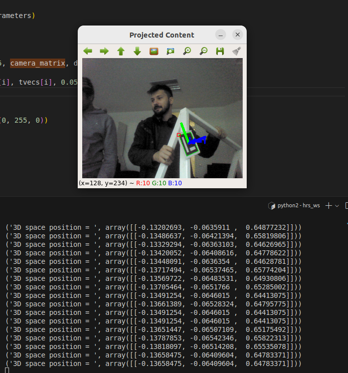

**Figure 9:** Tracking a marker with 2nd pose

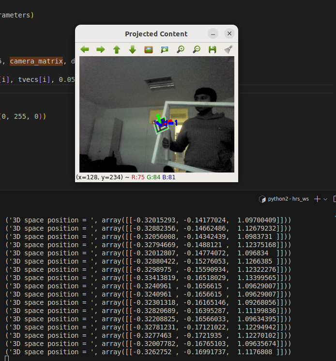

**Figure 10:** Tracking a marker with 3rd pose
