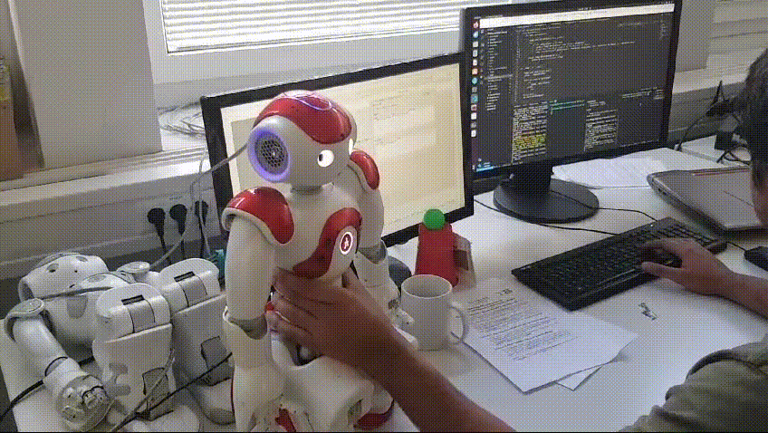

# HRS Tutorial 5

This branch hosts tutorial 5 for lecture Humanoid Robotic Systems.

Same README as html file is available in the root foler, which is easier to read.

## Building

After the devcontainer is built, make sure the scripts is executable, note that we have 2 python nodes

```bash
chmod +x hrs_ws/src/nao_control_tutorial_1/scripts/move_client.py
chmod +x hrs_ws/src/nao_control_tutorial_1/scripts/move_service.py
```

then, in the `hrs_ws/` build the workspace:

```bash
catkin build
```

## Runing

*Important -- The left arm of the robot that is assigned to our group with ip address ends with 114 has an actuator issue, if you are testing the code on this very robot, the left arm won't move correctly. The provided test results are recorded on another functioning robot.*

To run the node, firstly bring up the nao robot, and start the service server with:

```bash
roslaunch nao_control_tutorial_1 nao.launch
```

**For exercise 2, task 1:** navigate to the [cpp client script](./hrs_ws/src/nao_control_tutorial_1/src/client.cpp), on the top of the scipt, set `mode` to 1. Build the package again, then run with:

```bash
rosrun nao_control_tutorial_1 nao_1
```

You will see both arm of nao are raised as shown here:



a video is also provided [here](./hrs_ws/src/nao_control_tutorial_1/doc/e2_1.mov).

**For exercise 2, task 2:** navigate to the [cpp client script](./hrs_ws/src/nao_control_tutorial_1/src/client.cpp), on the top of the scipt, set `mode` to 2, and you can play with the `angles_interpolate` flag to change between `setAngles` and `angleInterpolation`.

```bash
rosrun nao_control_tutorial_1 nao_1
```

This time only the left arm will be raised


a video is also provided [here](./hrs_ws/src/nao_control_tutorial_1/doc/e2_2.mov).

**For exercise 3:** this time we provide a python node as client, navigate to [the python client script](./hrs_ws/src/nao_control_tutorial_1/script/move_client.py), at line 72, set the second flag as `True` and `False` to switch between `setAngles` and `angleInterpolation`.

```bash
rosrun nao_control_tutorial_1 move_client.py
```

The following gif shows the test result with `setAngles`, video can be found [here](./hrs_ws/src/nao_control_tutorial_1/doc/e3_1.MP4).


And here is the test result for `angleInterpolation`, video can be found [here](./hrs_ws/src/nao_control_tutorial_1/doc/e3_2.mov)

