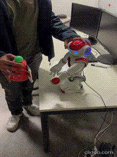

# HRS Tutorial 6

**:exclamation: Important: The right shoulder joint of the robot assigned to our group (IP address: 10.152.246.114) is defekt, specificaly, the LShoulderPitch motion is not possible. The tests and records are done with another robot with IP address 10.152.246.194!**

This branch hosts tutorial 6 for lecture Humanoid Robotic Systems.

[Same README as html file](./README.html) is available in the root foler, which is easier to read.

## Building

After the devcontainer is built, make sure the scripts are executable:

```bash
chmod +x hrs_ws/src/nao_control_tutorial_2/script/*.py
```

then, in the `hrs_ws` build the workspace:

```bash
catkin build
```

## Running

For this tutorial, you need at least 3 terminals.

### Bringup and Service

Before running the code, bringup the robot in the first terminal,

```bash
roslaunch nao_bringup nao_full_py.launch
```

and then in the 2nd terminal, launch the service:

```bash
roslaunch nao_control_tutorial_2 nao.launch
```

### Exercise 1

For exercise 1, run the following command in the 3rd terminal to move the robot arm using **`ALMotionProxy::setPositions()`** method

```bash
rosrun nao_control_tutorial_2 move_client.py
```

Uncomment line 73 and comment out line 74 in [client node](./hrs_ws/src/nao_control_tutorial_2/script/move_client.py) to call the service with **`ALMotionProxy::positionInterpolations()`** method, you can run the command above again to see the difference.

As an example, here is a record of the test with `ALMotionProxy::positionInterpolations()` method, video is attached [here](./hrs_ws/src/nao_control_tutorial_2/doc/exercise_1.mov)


### Exercise 2

Run the following cammand in the 3rd terminal to let the robot track the aruco marker

```bash
rosrun nao_control_tutorial_2 move_client2.py
```

Here is the test result of this exercise, you can find video [here](./hrs_ws/src/nao_control_tutorial_2/doc/exercise_2_4.0x.mov), for safety consideration, the execution is moderated to 0.5Hz and the video is 4x accelerated


