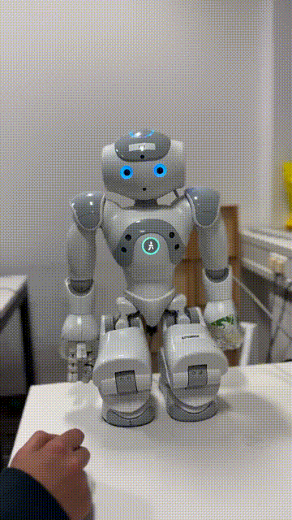
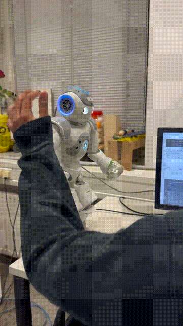

# HRS Tutorial 7

This branch hosts tutorial 7 for lecture Humanoid Robotic Systems.

[Same README as html file](./README_recommanded.html) is available in the root foler, where the videos are converted into gif images, which is easier to read, thus recommended.

Group members: Rohan Singh, Richard Willke, Yueyang Zhang

## Building

After the devcontainer is built, make sure the scripts are executable:

```bash
chmod +x hrs_ws/src/nao_control_tutorial_3/script/nao_3.py
```

then, in the `hrs_ws/`, build the workspace:

```bash
catkin build
```

## Running

For this tutorial, you need at least 3 terminals.

### Bringup

Before running the code, bringup the robot in the first terminal,

```bash
roslaunch nao_bringup nao_full_py.launch
```

### Exercise 1: NAO, in the blink of an eye

For exercise 1, start the ros node for nao's leds in the 2nd terminal:

```bash
roslaunch nao_apps leds.launch
```

then, run the led control node in the last console:

```bash
rosrun nao_control_tutorial_3 nao_3
```

You can now try to press the bumpers of the nao robot and its eyes will blink with different colors, see the following image as example, video is attached [here](./hrs_ws/src/nao_control_tutorial_3/doc/e1.mp4).



### Exercise 2: Let’s talk NAO & Exercise 3: Take a walk with NAO

Exercise 2 and 3 are finished within the same python script, the functionalities can be tested with arbitary order.

For these 2 exercises, start the tactile node in the 2nd terminal:

```bash
roslaunch nao_apps tactile.launch
```

After which, run the control node (python) as follows, **Note:** after the node is started, the robot will stand up to the initial pose, don't be panic if the robot suddenly start to move.

```bash
rosrun nao_control_tutorial_3 nao_3.py
```

For exercise 2, you can tap the front tactile sensor of nao's head, you shall hear beeps of the robot, indicating the start of speech recognition, and also, you will read repeated prompts in console as `Got you` followed by the recognized word. For testing, only "yes", "no", "please", "hello" and "hi" will be recognized by the algorithm.

After your speech has been recorded (see terminal prompt for detail), tap the middle tactile sensor, the nao robot will then read the recorded words out. A video for this exercise is attached at [here](./hrs_ws/src/nao_control_tutorial_3/doc/e2.mp4).

For the final exercise, just tap the back tactile sensor, and the robot will start to walk, it will walk straight forward for 20cm (see the following gif image or see the [video](./hrs_ws/src/nao_control_tutorial_3/doc/e3.mp4)). If you want to change the target position and orientation, navigate to the [python node](./hrs_ws/src/nao_control_tutorial_3/script/nao_3.py), modify the data in function `walk()` at line 84, and run the node again to see the difference.


